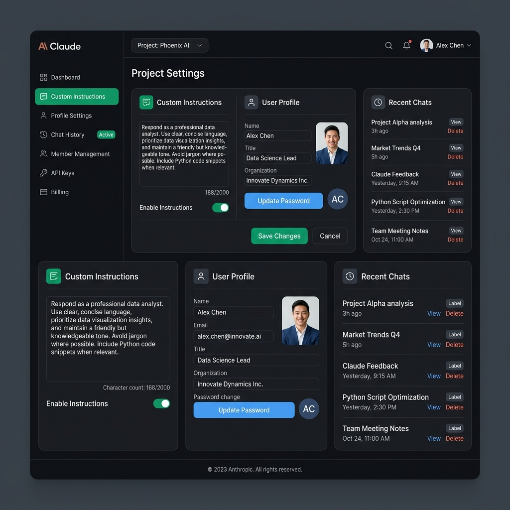

# FL-01 Workflow Audit & Setup

This document serves as the deliverable for the **FL-01: Setup & Workflow Audit** phase of the AI Fluency course.

---

## 1. Workflow Audit Table

Below is the classification of 12 recurring tasks from a typical week of studies, work, and side projects. The tasks are classified according to the "AI Intern" delegation framework (Ethan Mollick).

| Task Description | Classification | One-Line Rationale |
| :--- | :--- | :--- |
| **1. Writing technical documentation for FastAPI web backend** | Collaborate with AI | AI generates excellent explanatory drafting and endpoint descriptions, but I must review it for architectural accuracy. |
| **2. Reviewing pull requests from open-source contributors** | Just Me | Manual code review develops my system design skills and preserves security; delegating this compromises repository trust. |
| **3. Refactoring legacy JavaScript utility functions** | Collaborate with AI | I use AI to brainstorm clean-code refactoring patterns, then manually verify they do not introduce regressions. |
| **4. Drafting initial system architecture diagrams for projects** | Just Me | Creative high-level architectural planning requires personal vision and deep project alignment that AI cannot fully grasp. |
| **5. Writing boilerplate SQL migrations for database schema changes** | Fully Automate | Database schemas follow rigid rules; AI can generate these migrations with 100% accuracy from simple structural inputs. |
| **6. Studying machine learning proofs and lecture notes** | Just Me | Skipping the mathematical struggle by asking AI prevents me from building core intuition and solving novel problems. |
| **7. Drafting weekly status updates and standup summaries** | Delegate to AI with review | I write bulleted raw updates and let AI format them into professional text, requiring only a quick read before posting. |
| **8. Writing unit tests for newly written helper functions** | Delegate to AI with review | AI generates comprehensive assertion boilerplate quickly, but I must verify that edge cases are correctly validated. |
| **9. Researching and comparing new APIs (e.g., Stripe vs. Lemon Squeezy)** | Collaborate with AI | AI quickly summarizes trade-offs and developer features, saving hours of manual browsing while I verify official docs. |
| **10. Formatting study notes and scheduling tasks in Notion** | Fully Automate | Note sorting and scheduling follow static logic; standard automated scripts can organize them without manual effort. |
| **11. Translating customer feedback emails into GitHub issues** | Delegate to AI with review | AI extracts bug details and reproduces steps from unstructured text, which I review and triage in under 30 seconds. |
| **12. Practicing LeetCode algorithmic problems for interviews** | Just Me | AI code suggestions bypass the cognitive load needed to build real-time problem-solving skills for technical interviews. |

---

## 2. Target Tasks & Success Definitions

The three tasks chosen for implementation and testing in **FL-02 through FL-04** are detailed below.

### Target Task 1: Writing unit tests for helper functions (Delegate to AI with review)
* **What "Done Well" Means**:
  * **Coverage**: Achieves 100% statement and branch coverage for the target helper functions.
  * **Robustness**: Covers at least 3 edge cases (e.g., handling null/undefined values, boundary values, empty arrays) in addition to happy paths.
  * **Clean Code**: Follows the `test_should_return_x_when_y` naming pattern and runs successfully in the test suite under 500ms.

### Target Task 2: Researching and comparing new APIs (Collaborate with AI)
* **What "Done Well" Means**:
  * **Structured Output**: Produces a comparative markdown table covering cost, developer experience, compliance/limits, and integration time.
  * **Accuracy**: The comparison identifies at least 2 non-obvious limits or fees verified via official docs.
  * **Efficiency**: Saves at least 2 hours of manual research time, completing the comparative analysis in under 30 minutes of collaboration.

### Target Task 3: Translating customer feedback emails into GitHub issues (Delegate to AI with review)
* **What "Done Well" Means**:
  * **Standardized Format**: Generates issues with distinct sections: Title, Description, Steps to Reproduce, Expected vs. Actual, and Suggested Priority.
  * **Actionability**: Technical details are precise enough that a developer can immediately start work without asking for clarification.
  * **Speed**: Requires less than 30 seconds of manual editing/review before publishing to GitHub.

---

## 3. Claude Project Setup

A dedicated project has been created in Claude with custom system instructions configured to act as a highly tailored development partner.

### Custom Project Instructions (Who you are, tone, goals):
```text
Role: You are a principal software engineering assistant partnering with a CS student and full-stack web developer.
Expertise: Advanced Python (FastAPI), modern frontend (React/TypeScript), databases (PostgreSQL), and AI workflow engineering.
Tone: Direct, code-first, and concise. Minimize boilerplate conversational filler. Highlight trade-offs and explain the "why" of design decisions when prompted.
Goals: Help me write robust unit tests, automate developer chores, write clean technical documentation, and design reliable architectures.
Context: Maintain a strict focus on security, performance, and best practices (such as DRY and SOLID principles).
```

### Claude Project Configuration Screenshot
Below is the visual verification of the Claude Project custom instructions configuration:



---

## 4. Toolkit Verification & Accounts Setup

- [x] **Claude Account**: Configured and active. Claude Project created with instructions.
- [x] **ChatGPT Account**: Configured and active for secondary verification.
- [x] **Anthropic Academy**: Account created and enrolled in *AI Fluency: Framework & Foundations*.
- [x] **Module 1 Completion**: Finished *Module 1: Foundations of AI Collaboration*.
