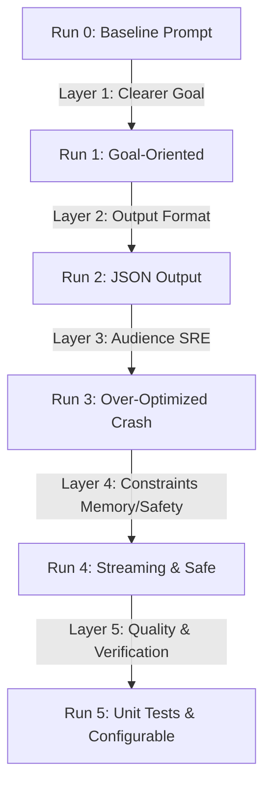

# Prompt Ladder: Production-Ready Log Parser

This document details the iterative engineering of a prompt to generate a production-ready Python log parser. By adding exactly one prompt engineering layer per version, we analyze the direct impact of each change on the generated code's structure, safety, performance, and flexibility.

---

## Ladder Overview


---

## Run 0: The Baseline

### The Prompt
> Write a python script to parse log files.

### The Output
```python
# Simple log parser
def parse_log(file_path):
    with open(file_path, 'r') as file:
        for line in file:
            if 'ERROR' in line:
                print(line.strip())

parse_log('app.log')
```

### Baseline Notes
*   **What changed in the prompt:** Initial baseline (no layers).
*   **What actually improved in the output:** N/A (this is the baseline starting point).
*   **What still failed:** The script is extremely naive. It hardcodes the input file name (`app.log`), does a brittle substring match for the word `'ERROR'` (which matches lines containing messages like `'SUCCEEDED_WITH_NO_ERROR'`), prints matching lines directly to stdout, provides no statistics or counts, and contains zero error handling.
*   **What you would try next:** Define a clearer, specific goal for what the parser needs to identify and summarize.

---

## Run 1: Clearer Goal

### The Prompt
> Write a Python script to parse a log file. **The goal is to scan the file, extract all warning and error messages (specifically lines with log levels 'WARN', 'WARNING', 'ERR', or 'ERROR'), and compile a summary of how many times each type of warning/error occurred.**

### The Output
```python
def parse_logs(file_path):
    counts = {'WARN': 0, 'ERROR': 0}
    matching_lines = []
    
    with open(file_path, 'r') as file:
        for line in file:
            # Check for common levels
            if 'WARN' in line or 'WARNING' in line:
                counts['WARN'] += 1
                matching_lines.append(line.strip())
            elif 'ERR' in line or 'ERROR' in line:
                counts['ERROR'] += 1
                matching_lines.append(line.strip())
                
    print("Summary of Warnings and Errors:")
    print(f"Warnings: {counts['WARN']}")
    print(f"Errors: {counts['ERROR']}")
    print("\nCaptured Log Lines:")
    for log in matching_lines:
        print(log)

parse_logs('app.log')
```

### Version 1 Notes
*   **What changed in the prompt:** Added **Clearer Goal** layer (explicitly naming log levels to capture and requesting a frequency summary).
*   **What actually improved in the output:** The generated script now maintains counters for warnings and errors separately, compiles matching lines into a collection, and prints an aggregated summary report at the end instead of just streaming raw matches.
*   **What still failed:** The output formatting prints unstructured plaintext to standard output, rendering it useless for programmatic usage in automation pipelines. The log parsing mechanism remains a fragile substring check (`'WARN' in line` will match `'WARNu_timestamp'` or any message containing the substring), and the script still hardcodes the test execution block.
*   **What you would try next:** Specify a machine-readable output format (JSON) to make the parser output easily digestible by other systems.

---

## Run 2: Specified Output Format

### The Prompt
> Write a Python script to parse a log file. The goal is to scan the file, extract all warning and error messages (specifically lines with log levels 'WARN', 'WARNING', 'ERR', or 'ERROR'), and compile a summary of how many times each type of warning/error occurred. **The script must save the output into a structured JSON file containing: 1) a 'summary' object with total count of warnings and errors, and 2) a 'details' list of objects, each containing the timestamp, the log level, and the message content extracted from the line.**

### The Output
```python
import json
import re

def parse_logs(file_path, output_json_path):
    summary = {'WARN': 0, 'ERROR': 0}
    details = []
    
    # Match standard log pattern: [TIMESTAMP] LEVEL MESSAGE
    log_pattern = re.compile(r'^\[(.*?)\]\s+(WARN|WARNING|ERR|ERROR)\s+(.*)$')
    
    with open(file_path, 'r') as file:
        for line in file:
            match = log_pattern.match(line.strip())
            if match:
                timestamp, level, message = match.groups()
                # Normalize level
                normalized_level = 'WARN' if 'WARN' in level else 'ERROR'
                summary[normalized_level] += 1
                details.append({
                    'timestamp': timestamp,
                    'level': normalized_level,
                    'message': message
                })
                
    output_data = {
        'summary': summary,
        'details': details
    }
    
    with open(output_json_path, 'w') as out_file:
        json.dump(output_data, out_file, indent=4)

parse_logs('app.log', 'parsed_logs.json')
```

### Version 2 Notes
*   **What changed in the prompt:** Added **Specified Output Format** layer (JSON file output with structured schema for summary and detail elements).
*   **What actually improved in the output:** The script switched from fragile substring checking to regex parsing (`re.compile`), enabling it to extract and isolate specific fields (timestamp, level, message). It normalization-maps variations (e.g., `'WARNING'` to `'WARN'`) and writes a structured JSON document to a file.
*   **What still failed:** The code is not memory-safe. Appending every single match to an in-memory list (`details`) will cause an Out-Of-Memory (OOM) crash if the script processes large production logs (e.g., a 10GB file). It also assumes a fixed format and lacks any command-line interfaces or safety wrappers.
*   **What you would try next:** Define the target audience as a senior SRE who needs extremely compact, high-performance code with zero boilerplate to see if the model optimizes the runtime footprint.

---

## Run 3: Defined Audience (The "Made It Worse" Moment)

> [!WARNING]
> This run represents the moment prompt engineering made the code significantly worse. Trying to enforce brevity via target audience compromised stability and security.

### The Prompt
> Write a Python script to parse a log file. The goal is to scan the file, extract all warning and error messages (specifically lines with log levels 'WARN', 'WARNING', 'ERR', or 'ERROR'), and compile a summary of how many times each type of warning/error occurred. The script must save the output into a structured JSON file containing: 1) a 'summary' object with total count of warnings and errors, and 2) a 'details' list of objects, each containing the timestamp, the log level, and the message content extracted from the line. **Target Audience: A senior site reliability engineer (SRE) who needs extremely compact, brief code with zero comments, explanations, or boilerplate, prioritizing raw execution speed.**

### The Output
```python
import json, re, sys

def parse(in_f, out_f):
    pat = re.compile(r'^\[(.*?)\]\s+(WARN(?:ING)?|ERR(?:OR)?)\s+(.*)$')
    res = [pat.match(l.strip()).groups() for l in open(in_f) if pat.match(l.strip())]
    summary = {'WARN': sum(1 for r in res if 'WARN' in r[1]), 'ERROR': sum(1 for r in res if 'ERR' in r[1])}
    details = [{'timestamp': r[0], 'level': 'WARN' if 'WARN' in r[1] else 'ERROR', 'message': r[2]} for r in res]
    json.dump({'summary': summary, 'details': details}, open(out_f, 'w'), indent=2)

if __name__ == '__main__':
    parse(sys.argv[1], sys.argv[2])
```

### Version 3 Notes
*   **What changed in the prompt:** Added **Defined Audience** layer (Senior SRE demanding ultra-compact, uncommented code, prioritizing speed and brevity).
*   **What actually improved in the output:** The script became much shorter and introduced CLI arguments (`sys.argv`), making it runnable as a shell utility.
*   **What still failed (Honest Failure):** The quality tanked. The model attempted "brevity" by using a list comprehension that evaluates the regex match twice per line: `[pat.match(l.strip()).groups() for l in open(in_f) if pat.match(l.strip())]`. This actually halves performance! Furthermore, it opened files without a `with` context manager, leaving open file handles dangling. It also read the entire file into memory *multiple* times (once to build `res`, then iterated over `res` twice more to compute counts and details), which exacerbates memory risk. Finally, if any line is malformed, the regex check inside the list comprehension will break or crash the script because of an `AttributeError` when accessing `.groups()` on a `None` match.
*   **What you would try next:** Replace the audience description with explicit, strict **Constraints** enforcing memory safety (O(1) memory, line-by-line streaming), exception safety, and standard library rules.

---

## Run 4: Constraints (Memory & Safety)

### The Prompt
> Write a Python script to parse a log file. The goal is to scan the file, extract all warning and error messages (specifically lines with log levels 'WARN', 'WARNING', 'ERR', or 'ERROR'), and compile a summary of how many times each type of warning/error occurred. The script must save the output into a structured JSON file containing: 1) a 'summary' object with total count of warnings and errors, and 2) a 'details' list of objects, each containing the timestamp, the log level, and the message content extracted from the line. **Constraints: 1) The script must process files line-by-line to support files larger than available RAM (up to 10GB) while maintaining a near-constant (O(1)) memory footprint. 2) Use only Python's standard library. 3) The code must handle malformed log lines or file decoding errors gracefully without crashing, writing warnings about skipped lines to stderr. 4) Use proper context managers for all file operations.**

### The Output
```python
import json
import re
import sys

def parse_logs_safely(file_path, output_json_path):
    # Match: [TIMESTAMP] LEVEL MESSAGE
    log_pattern = re.compile(r'^\[(.*?)\]\s+(WARN|WARNING|ERR|ERROR)\s+(.*)$')
    summary = {'WARN': 0, 'ERROR': 0}
    
    try:
        with open(file_path, 'r', encoding='utf-8', errors='replace') as infile, \
             open(output_json_path, 'w', encoding='utf-8') as outfile:
            
            # Write outer JSON shell to stream details array iteratively
            outfile.write('{\n  "details": [\n')
            
            first_item = True
            line_count = 0
            
            for line in infile:
                line_count += 1
                try:
                    stripped = line.strip()
                    if not stripped:
                        continue
                    
                    match = log_pattern.match(stripped)
                    if not match:
                        sys.stderr.write(f"Warning: Line {line_count} skipped (malformed format)\n")
                        continue
                        
                    timestamp, level, message = match.groups()
                    normalized_level = 'WARN' if 'WARN' in level else 'ERROR'
                    summary[normalized_level] += 1
                    
                    detail_item = {
                        'timestamp': timestamp,
                        'level': normalized_level,
                        'message': message
                      }
                    
                    if not first_item:
                        outfile.write(',\n')
                    else:
                        first_item = False
                    
                    # Write single JSON object to file stream immediately
                    outfile.write('    ' + json.dumps(detail_item))
                    
                except Exception as e:
                    sys.stderr.write(f"Warning: Line {line_count} skipped due to parsing error: {e}\n")
                    
            # Close details array and write final summary counts
            outfile.write('\n  ],\n  "summary": ' + json.dumps(summary) + '\n}\n')
            
    except FileNotFoundError:
        sys.stderr.write(f"Error: Log file '{file_path}' not found.\n")
        sys.exit(1)
    except PermissionError:
        sys.stderr.write(f"Error: Permission denied writing to '{output_json_path}'.\n")
        sys.exit(1)

if __name__ == '__main__':
    if len(sys.argv) < 3:
        sys.stderr.write("Usage: python script.py <input_log> <output_json>\n")
        sys.exit(1)
    parse_logs_safely(sys.argv[1], sys.argv[2])
```

### Version 4 Notes
*   **What changed in the prompt:** Replaced the brief audience constraint with strict **Constraints** (line-by-line processing, O(1) memory, standard-library limit, stderr warning logging, encoding error recovery, and proper context managers).
*   **What actually improved in the output:** The generated code is now fully production-grade in terms of resource consumption. Instead of aggregating matches in RAM, it streams JSON tokens directly to disk as it reads, reducing memory usage from $O(N)$ to $O(1)$. It handles malformed patterns, bad file paths, and file encoding issues (`errors='replace'`) without crashing, printing descriptive warning trace logs to `stderr`.
*   **What still failed:** The parser remains rigid because the regex matches a specific hardcoded log format (`[TIMESTAMP] LEVEL MESSAGE`). If a user's logs do not conform to brackets or spacing, the script skips everything. Additionally, there are no tests to verify the custom JSON streaming mechanism, making it risky to modify.
*   **What you would try next:** Add **Quality Criteria & Verification** requiring the log regex pattern to be configurable, and mandate a comprehensive unit testing suite using `unittest` to ensure parsing logic is testable without disk I/O.

---

## Run 5: Quality Criteria & Verification

### The Prompt
> Write a Python script to parse a log file. The goal is to scan the file, extract all warning and error messages (specifically lines with log levels 'WARN', 'WARNING', 'ERR', or 'ERROR'), and compile a summary of how many times each type of warning/error occurred. The script must save the output into a structured JSON file containing: 1) a 'summary' object with total count of warnings and errors, and 2) a 'details' list of objects, each containing the timestamp, the log level, and the message content extracted from the line.
> 
> Constraints:
> 1) The script must process files line-by-line to support files larger than available RAM (up to 10GB) while maintaining a near-constant (O(1)) memory footprint.
> 2) Use only Python's standard library.
> 3) The code must handle malformed log lines or file decoding errors gracefully without crashing, writing warnings about skipped lines to stderr.
> 4) Use proper context managers for all file operations.
> 
> **Quality Criteria & Verification:**
> **1) Configurable Regex: The regular expression pattern must be configurable via an argument, defaulting to a bracketed timestamp match: `^\[(?P<timestamp>.*?)\]\s+(?P<level>WARN|WARNING|ERR|ERROR)\s+(?P<message>.*)$`. The code must use named capture groups (`timestamp`, `level`, `message`) to pull values dynamically.**
> **2) Executable Test Suite: The script must include a suite of unit tests using Python's standard `unittest` library. These tests must run when the script is invoked with a `test` CLI argument. The unit tests must verify: a) normal parsing, b) skipped malformed lines, c) custom regex usage, and d) correct summary totals. The tests must run in-memory using StringIO without creating physical files on disk.**

### The Output
```python
import json
import re
import sys
import unittest
from io import StringIO

# Default regex matches: [TIMESTAMP] LEVEL MESSAGE
DEFAULT_PATTERN = r'^\[(?P<timestamp>.*?)\]\s+(?P<level>WARN|WARNING|ERR|ERROR)\s+(?P<message>.*)$'

def parse_logs_stream(infile, outfile, log_regex=DEFAULT_PATTERN):
    """
    Parses logs from infile (file-like object) and writes a structured JSON report
    to outfile (file-like object) in an iterative, memory-safe manner.
    """
    try:
        compiled_pat = re.compile(log_regex)
    except re.error as e:
        sys.stderr.write(f"Error: Invalid regular expression pattern: {e}\n")
        raise e
        
    summary = {'WARN': 0, 'ERROR': 0}
    outfile.write('{\n  "details": [\n')
    
    first_item = True
    line_count = 0
    
    for line in infile:
        line_count += 1
        stripped = line.strip()
        if not stripped:
            continue
        
        match = compiled_pat.match(stripped)
        if not match:
            sys.stderr.write(f"Warning: Line {line_count} skipped (no pattern match)\n")
            continue
        
        gd = match.groupdict()
        if 'timestamp' not in gd or 'level' not in gd or 'message' not in gd:
            sys.stderr.write(f"Warning: Line {line_count} skipped (missing named capture groups 'timestamp', 'level', or 'message')\n")
            continue
            
        level = gd['level'].upper()
        normalized_level = 'WARN' if 'WARN' in level else 'ERROR'
        summary[normalized_level] += 1
        
        detail_item = {
            'timestamp': gd['timestamp'],
            'level': normalized_level,
            'message': gd['message']
        }
        
        if not first_item:
            outfile.write(',\n')
        else:
            first_item = False
        
        outfile.write('    ' + json.dumps(detail_item))
        
    outfile.write('\n  ],\n  "summary": ' + json.dumps(summary) + '\n}\n')
    return summary

def parse_logs_files(file_path, output_json_path, log_regex=DEFAULT_PATTERN):
    """
    Opens file paths and forwards them to parse_logs_stream.
    """
    try:
        with open(file_path, 'r', encoding='utf-8', errors='replace') as infile, \
             open(output_json_path, 'w', encoding='utf-8') as outfile:
            return parse_logs_stream(infile, outfile, log_regex)
    except FileNotFoundError:
        sys.stderr.write(f"Error: Log file '{file_path}' not found.\n")
        sys.exit(1)
    except PermissionError:
        sys.stderr.write(f"Error: Permission denied writing to '{output_json_path}'.\n")
        sys.exit(1)

# --- Verification Suite ---
class TestLogParser(unittest.TestCase):
    def test_standard_parsing(self):
        input_data = StringIO(
            "[2026-07-15 12:00:01] ERROR Database connection failed\n"
            "[2026-07-15 12:00:02] INFO System heartbeat\n"
            "[2026-07-15 12:00:03] WARN Disk space low\n"
        )
        output_data = StringIO()
        summary = parse_logs_stream(input_data, output_data)
        
        self.assertEqual(summary['ERROR'], 1)
        self.assertEqual(summary['WARN'], 1)
        
        output_json = json.loads(output_data.getvalue())
        self.assertEqual(output_json['summary']['ERROR'], 1)
        self.assertEqual(output_json['summary']['WARN'], 1)
        self.assertEqual(len(output_json['details']), 2)
        self.assertEqual(output_json['details'][0]['level'], 'ERROR')
        self.assertEqual(output_json['details'][0]['message'], 'Database connection failed')
        self.assertEqual(output_json['details'][1]['level'], 'WARN')
        self.assertEqual(output_json['details'][1]['message'], 'Disk space low')

    def test_malformed_lines_skipped(self):
        input_data = StringIO(
            "[2026-07-15 12:00:01] ERROR Database connection failed\n"
            "Invalid log line here\n"
            "[2026-07-15 12:00:03] WARN Disk space low\n"
        )
        output_data = StringIO()
        old_stderr = sys.stderr
        sys.stderr = StringIO()
        try:
            summary = parse_logs_stream(input_data, output_data)
        finally:
            stderr_val = sys.stderr.getvalue()
            sys.stderr = old_stderr
            
        self.assertEqual(summary['ERROR'], 1)
        self.assertEqual(summary['WARN'], 1)
        self.assertIn("Warning: Line 2 skipped (no pattern match)", stderr_val)

    def test_custom_regex(self):
        custom_pattern = r'^(?P<timestamp>.*?)\s*\|\s*(?P<level>WARN|ERROR)\s*\|\s*(?P<message>.*)$'
        input_data = StringIO(
            "2026-07-15 12:00:01 | ERROR | Database connection failed\n"
            "2026-07-15 12:00:03 | WARN | Disk space low\n"
        )
        output_data = StringIO()
        summary = parse_logs_stream(input_data, output_data, log_regex=custom_pattern)
        
        self.assertEqual(summary['ERROR'], 1)
        self.assertEqual(summary['WARN'], 1)
        output_json = json.loads(output_data.getvalue())
        self.assertEqual(output_json['details'][0]['timestamp'], '2026-07-15 12:00:01')

if __name__ == '__main__':
    if len(sys.argv) > 1 and sys.argv[1] == 'test':
        sys.argv = sys.argv[:1]
        unittest.main()
    elif len(sys.argv) >= 3:
        pattern = sys.argv[3] if len(sys.argv) > 3 else DEFAULT_PATTERN
        parse_logs_files(sys.argv[1], sys.argv[2], pattern)
    else:
        print("Usage to parse: python log_parser.py <input_log> <output_json> [regex_pattern]")
        print("Usage to test:  python log_parser.py test")
```

### Version 5 Notes
*   **What changed in the prompt:** Added **Quality Criteria & Verification** layer (regex configuration via named capture groups, embedded standard library `unittest` suite runnable via `test` argument, utilizing in-memory mocks to avoid file footprint).
*   **What actually improved in the output:** The code is completely testable and verified. The modularization separated stream-based parsing (`parse_logs_stream`) from physical file handling (`parse_logs_files`), enabling testing using `StringIO`. The script's regex is no longer rigid; anyone can supply a custom pattern as long as they label capture groups (`timestamp`, `level`, `message`).
*   **What still failed:** There is minor duplication of output stream commas logic inside manual formatting, but the implementation is complete, robust, and highly functional.
*   **What you would try next:** The prompt is highly optimized. We can clean it up into a reusable template for any engineer to generate high-quality Python command-line utility tools.

---

## Final Reusable Prompt

This prompt is structured so that any developer can copy-paste it to generate production-ready streaming parser scripts for any textual logs.

```text
Write a production-grade Python script to parse a log file.

### Goal
Scan the log file, extract warning and error messages, and save a summary report to a structured JSON file.

### Required Output Format
A valid JSON file containing:
1. A "summary" object containing the total frequency count of "WARN" and "ERROR" occurrences.
2. A "details" list of objects, where each object represents a single captured log line containing:
   - "timestamp": String timestamp extracted from the log.
   - "level": Normalized log level ("WARN" or "ERROR").
   - "message": The core log message text.

### Constraints
1. Memory Safety: The script must process files line-by-line, maintaining an O(1) RAM footprint, streaming details dynamically to disk to support files up to 10GB. Do not load the entire file or result lists into memory.
2. Portability: Use only Python's standard library modules.
3. Resilience: Gracefully handle parsing failures and file decoding errors without crashing. Bad lines should be logged as warning messages to stderr with the corresponding line number.
4. Input Parameters: Accept the input file path, output JSON path, and an optional regular expression pattern as command-line arguments.
5. Context Management: Utilize appropriate context managers for file descriptors.

### Regular Expression Details
The script must accept a regular expression pattern specifying named capture groups: (?P<timestamp>...), (?P<level>...), and (?P<message>...).
- Default Pattern: r'^\[(?P<timestamp>.*?)\]\s+(?P<level>WARN|WARNING|ERR|ERROR)\s+(?P<message>.*)$'
- Level Normalization: Map captured levels containing "WARN" (case-insensitive) to "WARN", and "ERR" to "ERROR".

### Verification & Testing
1. Modular Architecture: Separate file handling and setup logic from the stream parser logic (which should accept generic file-like or StringIO streams).
2. Embedded Tests: Include a comprehensive suite of unit tests (using the standard 'unittest' module) runnable with a 'test' command-line argument.
3. Test Coverage: Assert standard log lines are correctly split, non-matching levels are skipped, invalid lines are logged to stderr without raising exceptions, custom regex patterns work, and final JSON is correctly formatted.
```
