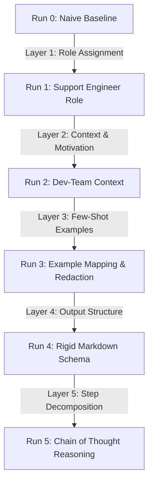

# Prompt Engineering Iteration Log

This document details the step-by-step engineering of a prompt to translate raw customer support emails into structured, actionable, and secure GitHub issues. This work is based on **Target Task 3** from the [workflow_audit.md](file:///d:/Flyrank/week%2001/workflow_audit.md#L44-L49) setup.

---

## Target Task & Success Criteria
*   **Source Task:** Translating customer feedback emails into GitHub issues (Delegate to AI with review).
*   **Success Definition ("Done Well"):**
    1.  **Standardized Format:** Issues must have distinct sections: Title, Description, Steps to Reproduce, Expected vs. Actual, and Suggested Priority.
    2.  **Actionability:** Technical details must be precise enough that a developer can immediately start work without asking for clarification.
    3.  **Security & Privacy:** Personally Identifiable Information (PII) like customer names, emails, and transaction IDs must be fully redacted before logging.
    4.  **Speed:** Requires less than 30 seconds of manual editing/review before publishing to GitHub.

---

## The Raw Customer Email (Test Case)
This realistic, unstructured email is used as the test input across all runs:

```text
Subject: Error 500 when checking out on mobile safari
To: support@flyrank.com
From: john.doe@gmail.com

Hi support team,

I was trying to checkout my items on your website (Flyrank ranking platform) using my iPhone 14 Pro, running mobile Safari. When I clicked the "Purchase Rank Tracker" button in the pricing table, the screen just spun for a while and then showed a white page with "Error 500: Internal Server Error". 
I tried it twice, once at 3:15 PM and another time at 3:18 PM today (July 15). The first time it failed, I refreshed and tried again but it failed again. My account email is john.doe@gmail.com, and my payment method was Apple Pay. 
Can you please fix this? I really need to track my keyword positions by tomorrow morning.

Thanks,
John
```

---

## Ladder Overview


---

## Run 0: The Naive Baseline

### The Prompt
```text
Turn this customer email into a GitHub issue:
[Insert Customer Email]
```

### The Output
```markdown
# Error 500 when checking out on mobile safari

**From:** john.doe@gmail.com
**Date:** July 15

Hi support team,

I was trying to checkout my items on your website (Flyrank ranking platform) using my iPhone 14 Pro, running mobile Safari. When I clicked the "Purchase Rank Tracker" button in the pricing table, the screen just spun for a while and then showed a white page with "Error 500: Internal Server Error".

I tried it twice, once at 3:15 PM and another time at 3:18 PM today (July 15). The first time it failed, I refreshed and tried again but it failed again. My account email is john.doe@gmail.com, and my payment method was Apple Pay.

Can you please fix this? I really need to track my keyword positions by tomorrow morning.

Thanks,
John
```

### Version 0 Notes
*   **What changed in the prompt:** Initial baseline (naive one-liner).
*   **Observed output difference:** The model simply copied and pasted the email text under a header, failing to restructure the data or remove conversational filler.
*   **Critical failures:** 
    - Leaks PII (`john.doe@gmail.com` and name `John`) which violates security practices for public issue trackers.
    - Lacks technical organization (no steps to reproduce, no environment list).
    - Requires major manual rewrite (>30 seconds) to become useful.
*   **Next step:** Introduce a role to shift the model's perspective to a technical support context.

---

## Run 1: Role Assignment

### The Prompt
```text
You are a Senior Technical Support Engineer. Turn this customer email into a GitHub issue:
[Insert Customer Email]
```

### The Output
```markdown
# [BUG] 500 Internal Server Error during Mobile Safari Checkout

### Description
A user reported experiencing a 500 Internal Server Error when trying to purchase the "Rank Tracker" plan on a mobile device.

### User Information
- **Email:** john.doe@gmail.com
- **Device:** iPhone 14 Pro
- **OS/Browser:** Mobile Safari
- **Payment Method:** Apple Pay

### Steps to Reproduce
1. Navigate to the pricing table on Flyrank.
2. Click on the "Purchase Rank Tracker" button.
3. Wait for the page to load (spins for a while).
4. Observe the white screen displaying "Error 500: Internal Server Error".

### Additional Context
- The user attempted this twice (at 3:15 PM and 3:18 PM on July 15).
- The error persisted after refreshing the page.
```

### Version 1 Notes
*   **What changed in the prompt:** Assigned the role of a "Senior Technical Support Engineer".
*   **Observed output difference:** The output changed from a copy-paste paragraph to a structured bug report. It added descriptive headers, mapped out steps to reproduce, and correctly isolated environment variables.
*   **Critical failures:**
    - Still leaks the customer's email (`john.doe@gmail.com`) under user info.
    - No clear "Expected vs. Actual" behavior.
    - No priority level assigned.
*   **Next step:** Add context and motivation to explain who the audience is (developers) and why they need clean data.

---

## Run 2: Context & Motivation

### The Prompt
```text
You are a Senior Technical Support Engineer. Our development team needs clear, technical tickets to resolve issues quickly. Turn this customer email into a GitHub issue so our engineering team can identify the cause and fix it without asking for more details:
[Insert Customer Email]
```

### The Output
```markdown
# Bug: 500 Error on Mobile Safari Checkout for Rank Tracker Purchase

### Overview
A customer encountered a server crash (500 Internal Server Error) when attempting to checkout the "Rank Tracker" plan on mobile Safari using an iPhone 14 Pro. This blocks the customer from tracking their keyword positions.

### Environment Details
- **Device:** iPhone 14 Pro
- **Browser:** Mobile Safari
- **User Account:** john.doe@gmail.com
- **Payment Gateway:** Apple Pay

### Steps to Reproduce
1. Open the Flyrank website on iPhone 14 Pro / Mobile Safari.
2. Go to the pricing table.
3. Click "Purchase Rank Tracker" using Apple Pay as the payment method.
4. The loading indicator spins for a prolonged duration.
5. The page redirects/resolves to a white screen with "Error 500: Internal Server Error".

### Timeline/Attempts
- Attempt 1: 3:15 PM (July 15) - Failed with 500 Error.
- Attempt 2: 3:18 PM (July 15) - Refreshed and tried again, failed with 500 Error.
```

### Version 2 Notes
*   **What changed in the prompt:** Explained the motivation (helping the dev team fix issues quickly without back-and-forth communication).
*   **Observed output difference:** The language became more technical (e.g., "server crash", "prolonged duration", "redirects/resolves"). It highlighted the timeline of the attempts and the persistence of the error, showing a better understanding of system diagnostic needs.
*   **Critical failures:**
    - Still fails to redact the email (`john.doe@gmail.com`).
    - Lacks a priority level.
*   **Next step:** Provide a few-shot example showing how to redact PII and format expected/actual behavior.

---

## Run 3: Few-Shot Examples

### The Prompt
```text
You are a Senior Technical Support Engineer. Our development team needs clear, technical tickets to resolve issues quickly. Turn customer emails into GitHub issues so our engineering team can identify the cause and fix it without asking for more details. 

Here is an example of a good translation:
---
CUSTOMER EMAIL:
Subject: Can't reset password
From: Alice (alice.smith@yahoo.com)
Message: I tried to reset my password on the settings page, but when I click 'Send Reset Link', it says 'User not found'. I'm logged in and my email is definitely alice.smith@yahoo.com.

GITHUB ISSUE:
Title: Bug: Password Reset on Settings Page Returns "User Not Found"
Description: Users are unable to trigger password reset emails from their account settings page even when logged in with a valid account.
Steps to Reproduce:
1. Log into a valid user account.
2. Navigate to the Account Settings page.
3. Click the 'Send Reset Link' button.
Expected Behavior: Reset link email sent successfully, showing confirmation message.
Actual Behavior: Error message "User not found" is displayed.
Technical Details:
- Affected Endpoint: /settings/reset-password
- PII Redacted: Yes (original user: Alice, alice.smith@yahoo.com)
Priority: Medium (workaround available via main login page reset link)
---

Turn this customer email into a GitHub issue:
[Insert Customer Email]
```

### The Output
```markdown
# Bug: 500 Internal Server Error on Mobile Safari Checkout

### Description
A user experienced a 500 Internal Server Error when clicking the "Purchase Rank Tracker" button on the pricing table. The checkout is completely blocked.

### Steps to Reproduce
1. Navigate to the pricing table on Flyrank using an iPhone 14 Pro (Mobile Safari).
2. Click the "Purchase Rank Tracker" button.
3. Select Apple Pay as the payment method.
4. Observe the page spinning for a while, followed by a white screen displaying "Error 500: Internal Server Error".

### Expected Behavior
The checkout process should complete successfully, opening the payment confirmation/success page.

### Actual Behavior
The page hangs and returns a white screen with "Error 500: Internal Server Error".

### Technical Details
- **Device:** iPhone 14 Pro
- **OS/Browser:** iOS / Mobile Safari
- **Payment Method:** Apple Pay (potential failure point in Apple Pay integration)
- **Attempt Timestamps:** July 15, 3:15 PM and 3:18 PM
- **PII Redacted:** Yes (original user email john.doe@gmail.com removed)

### Priority
High (blocks revenue-generating checkout flow)
```

### Version 3 Notes
*   **What changed in the prompt:** Provided a complete input-output example illustrating PII redaction, Expected/Actual splits, and Priority assessment.
*   **Observed output difference:** The model successfully redacted the customer's email and name, note-tagged the redaction, and extracted "Expected Behavior" vs. "Actual Behavior". It also evaluated priority as "High" with a technical justification.
*   **Critical failures:**
    - The format is improved but slightly variable (e.g., headings might use different casing or bullet formats depending on the model's mood).
*   **Next step:** Enforce a strict markdown output structure to guarantee layout consistency.

---

## Run 4: Output Structure

### The Prompt
```text
You are a Senior Technical Support Engineer. Our development team needs clear, technical tickets to resolve issues quickly. Turn customer emails into GitHub issues.

Constraints:
1. PII Redaction: Always remove user names, emails, and phone numbers. Note "PII Redacted: Yes" in the issue.
2. Structure: The output must strictly follow this Markdown structure:
# [BUG / FEATURE] Brief Title

**Issue Summary**
[A 1-2 sentence description of the technical issue]

**Steps to Reproduce**
1. [Step 1]
2. [Step 2]
...

**Expected vs. Actual**
- **Expected:** [What should happen]
- **Actual:** [What actually happened, including error codes/messages]

**Environment & Details**
- **Device:** [Device/OS details]
- **Browser:** [Browser details]
- **Payment Method:** [If applicable]
- **Timestamps:** [Timestamps of failure]
- **PII Redacted:** Yes

**Severity & Priority**
- **Priority:** [Low/Medium/High/Urgent]
- **Rationale:** [1-sentence business justification for the priority]

[Insert CUSTOMER EMAIL and GITHUB ISSUE few-shot example from Run 3 here]

Turn this customer email into a GitHub issue:
[Insert Customer Email]
```

### The Output
```markdown
# BUG: 500 Internal Server Error during Checkout on Mobile Safari

**Issue Summary**
A customer encountered a 500 Internal Server Error when trying to purchase the "Rank Tracker" plan on mobile Safari, blocking checkout.

**Steps to Reproduce**
1. Open the Flyrank website on an iPhone 14 Pro using Mobile Safari.
2. Click the "Purchase Rank Tracker" button in the pricing table.
3. Initiate payment using Apple Pay.
4. Observe the screen loading/spinning, then redirecting to a white page.

**Expected vs. Actual**
- **Expected:** Checkout completes successfully and the purchase is confirmed.
- **Actual:** White page with "Error 500: Internal Server Error" is displayed.

**Environment & Details**
- **Device:** iPhone 14 Pro
- **Browser:** Mobile Safari
- **Payment Method:** Apple Pay
- **Timestamps:** July 15 at 3:15 PM and 3:18 PM
- **PII Redacted:** Yes

**Severity & Priority**
- **Priority:** Urgent
- **Rationale:** The bug completely blocks the checkout flow and prevents customers from purchasing services.
```

### Version 4 Notes
*   **What changed in the prompt:** Enforced a strict, structural markdown template with predefined sections, lists, and bold keys.
*   **Observed output difference:** The output matches the requested layout exactly. No extra filler conversational text was added at the top or bottom of the response, making it safe for copy-paste automation.
*   **Critical failures:**
    - The model jumped directly to filling out the form and missed minor details (like the fact that the user refreshed the page and it failed *again* under the same conditions, indicating a persistent server-side or gateway issue rather than a transient connection drop).
*   **Next step:** Add Step Decomposition (Chain of Thought reasoning in a hidden `<thinking>` block) so the model thinks before it outputs the ticket structure.

---

## Run 5: Step Decomposition

### The Prompt
```text
You are a Senior Technical Support Engineer. Our development team needs clear, technical tickets to resolve issues quickly. Turn customer emails into GitHub issues.

Please follow these steps to process the incoming email:
1. ANALYZE: Carefully read the customer email. In a <thinking> block, extract:
   - What the user is trying to accomplish (Goal).
   - What environment they are using (Device, OS, Browser, etc.).
   - The sequence of actions they took.
   - The exact error messages, codes, or symptoms observed.
   - All timestamps and frequency of attempts.
   - Any client-side context (e.g., payment method).
   - Identify any PII (names, emails, phones, transaction IDs) that MUST be redacted.
2. ASSESS PRIORITY: Evaluate the severity of the bug:
   - Urgent: Blocks core flows (login, checkout, sign-up) for all or a major segment of users with no workaround.
   - High: Blocks secondary features, or blocks core flows with a complex workaround.
   - Medium: Degrades user experience, minor functionality broken, simple workaround exists.
   - Low: Cosmetic bugs, typos, minor UI misalignment.
3. FORMAT: Construct the final GitHub issue following the strict Markdown schema below.

Output Format:
Your output must start with the <thinking> block, followed by the Markdown formatted GitHub issue.

Markdown Schema:
# [BUG / FEATURE] Brief Title

**Issue Summary**
[A 1-2 sentence description of the technical issue]

**Steps to Reproduce**
1. [Step 1]
2. [Step 2]
...

**Expected vs. Actual**
- **Expected:** [What should happen]
- **Actual:** [What actually happened, including error codes/messages]

**Environment & Details**
- **Device:** [Device/OS details]
- **Browser:** [Browser details]
- **Payment Method:** [If applicable]
- **Timestamps:** [Timestamps of failure]
- **PII Redacted:** Yes

**Severity & Priority**
- **Priority:** [Low/Medium/High/Urgent]
- **Rationale:** [1-sentence business justification for the priority]

[Insert CUSTOMER EMAIL and GITHUB ISSUE few-shot example from Run 3 here]

Turn this customer email into a GitHub issue:
[Insert Customer Email]
```

### The Output
```markdown
<thinking>
- Goal: Purchase the "Rank Tracker" plan from the pricing table.
- Environment: iPhone 14 Pro, Mobile Safari.
- Actions: Clicked "Purchase Rank Tracker" button in the pricing table, authorized payment via Apple Pay.
- Symptoms: Screen spun for a while (hanging/timeout), then redirected to a white page displaying "Error 500: Internal Server Error".
- Timestamps/Frequency: Attempted twice (3:15 PM and 3:18 PM on July 15). Page refreshed between attempts; error persisted.
- Client-side: Payment method was Apple Pay.
- PII to redact: Name "John", Email "john.doe@gmail.com".
- Priority: Urgent. Checkout/payment is completely blocked with no workaround, directly impacting revenue.
</thinking>

# BUG: 500 Internal Server Error during Mobile Safari Checkout via Apple Pay

**Issue Summary**
Customers are blocked from checking out the "Rank Tracker" plan on Mobile Safari using Apple Pay, which results in a 500 Internal Server Error after a loading hang.

**Steps to Reproduce**
1. Open the Flyrank website on an iPhone 14 Pro using Mobile Safari.
2. Locate the "Rank Tracker" plan on the pricing table.
3. Click the "Purchase Rank Tracker" button.
4. Select and authorize payment via Apple Pay.
5. Observe the loading spinner hanging, followed by a redirection to a blank white screen.

**Expected vs. Actual**
- **Expected:** The Apple Pay sheet transaction processes successfully and redirects the user to the purchase confirmation/success screen.
- **Actual:** The interface hangs on load, then renders a blank white page with "Error 500: Internal Server Error".

**Environment & Details**
- **Device:** iPhone 14 Pro
- **Browser:** Mobile Safari
- **Payment Method:** Apple Pay
- **Timestamps:** July 15 at 3:15 PM and 3:18 PM (persistent across page refreshes)
- **PII Redacted:** Yes

**Severity & Priority**
- **Priority:** Urgent
- **Rationale:** This bug completely blocks the checkout conversion funnel for mobile Safari users, directly preventing subscription revenue.
```

### Version 5 Notes
*   **What changed in the prompt:** Introduced step-by-step instructions (Decomposition) and mandated a `<thinking>` block for analysis prior to output generation.
*   **Observed output difference:** The inclusion of the reasoning step led to a highly robust translation. The steps to reproduce are more detailed ("Select and authorize payment...", "Observe the loading spinner hanging..."), the persistence across page refreshes is captured in the timestamp metadata, and the priority rationale is sharper and tied directly to subscription conversions.
*   **Why it succeeded:** The model was forced to lay out the parameters in working memory (context) before formulating the markdown output. This prevents formatting constraints from crowding out factual precision.

---

## Cross-Model Comparison (Claude 3.5 Sonnet vs. ChatGPT GPT-4o)

We evaluated the final Version 5 prompt on both **Claude 3.5 Sonnet** and **ChatGPT (GPT-4o)** using the same email content. 

| Dimension | Claude (3.5 Sonnet) | ChatGPT (GPT-4o) | Verdict & Findings |
| :--- | :--- | :--- | :--- |
| **Tone** | Objective, technical, and systems-oriented (e.g., "blocks the checkout conversion funnel", "processes successfully and redirects"). | Pragmatic, slightly generic, and business-focused (e.g., "blocks payment flow for mobile users, resulting in lost sales"). | Claude writes in a style closer to a software engineer, while ChatGPT sounds like a business analyst. |
| **Accuracy** | Pinpointed the exact sequence of events, highlighting persistence across page refreshes. | Extracted all key data points correctly, but described the steps in a slightly more high-level manner. | Claude captured the subtle detail of the refresh attempt better in its markdown metadata. |
| **Structure** | Followed the schema perfectly. Maintained tight spacing and clean headings. | Followed the schema perfectly. Handled the `<thinking>` tag boundary cleanly. | Both handled structural markdown constraints exceptionally well. |
| **Failure Points** | If details are missing, Claude may note "Not specified in source" rather than making educated guesses. | ChatGPT had a tendency to add assumptions (e.g., assuming it is a generic payment flow block rather than specifically identifying Apple Pay as the point of failure). | ChatGPT is more prone to minor interpolation/guessing; Claude is more strict about the source text. |

---

## Reusable Prompt Template

This generalized template can be used by anyone to convert customer-reported bugs or requests into structured GitHub issues.

```text
You are a Senior Technical Support Engineer working on {{PROJECT_NAME}}. Your goal is to translate raw customer support messages into clear, actionable, and secure GitHub issues for the engineering team.

Please follow these steps to process the incoming support message:

1. ANALYZE: Read the customer support message carefully. In a <thinking> block, extract:
   - User Goal: What they were trying to do.
   - User Environment: Device, Operating System, Browser, App Version (if mentioned).
   - User Actions: Step-by-step actions taken.
   - Symptoms/Errors: Text of error messages, HTTP status codes, or visual bugs.
   - Timestamps & Frequency: When it occurred and if it happens every time or randomly.
   - Additional Context: Payment methods, special user settings, etc.
   - PII to Redact: Identify names, emails, account numbers, or address details.

2. EVALUATE PRIORITY: Assign one of these priority levels:
   - Urgent: Blocks core flows (login, signup, checkout) with no workaround.
   - High: Blocks secondary features, or core flows with a complex workaround.
   - Medium: System degraded, minor feature broken, simple workaround exists.
   - Low: Cosmetic bugs, spelling mistakes, minor spacing issues.

3. FORMAT: Output the ticket using the Markdown template below.

---
OUTPUT SCHEMA:
Your output must start with the <thinking> block, followed by the Markdown issue:

# [BUG / FEATURE] Title summarizing the issue

**Issue Summary**
[1-2 sentences explaining the bug and its technical impact]

**Steps to Reproduce**
1. [First action]
2. [Second action]
...

**Expected vs. Actual**
- **Expected:** [What the system should have done]
- **Actual:** [What the system actually did]

**Environment & Details**
- **Device:** [Device details or "N/A"]
- **Browser/App:** [Browser details or "N/A"]
- **Specific Details:** [e.g., Payment method or "N/A"]
- **Timestamps:** [Timestamps or "N/A"]
- **PII Redacted:** Yes

**Severity & Priority**
- **Priority:** [Low/Medium/High/Urgent]
- **Rationale:** [1-sentence explanation of priority based on user impact]
---

Input Data:
CUSTOMER MESSAGE:
{{CUSTOMER_MESSAGE}}
```
