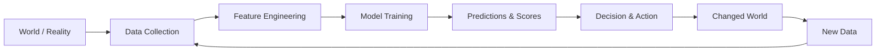

# Week 2 - Task 05: Machine Learning Systems & Task Framing

This document outlines the first-principles of Machine Learning (ML) systems and frames our capstone problem—**Lane 2: Refresh / Content Opportunity Scoring**—as a formal machine learning task.

---

## Part 1: First-Principles of Machine Learning Systems

### 1. AI vs. ML vs. Analytics vs. Rules

*   **Artificial Intelligence (AI):** The broadest umbrella term for systems that exhibit intelligent behavior or perform tasks that typically require human intelligence (e.g., natural language understanding, visual perception, decision-making).
*   **Machine Learning (ML):** A specific subset of AI where the system learns patterns and rules from historical data under mathematical assumptions, rather than being explicitly programmed. It focuses on generalization to unseen data.
*   **Analytics / Business Intelligence (BI):** Tools and processes that query, summarize, and display historical data to explain *what happened* in the past. It does not predict future events or automate decisions.
*   **Rules (Heuristics):** Explicit, hand-coded logic (e.g., `if-then` statements) created by humans based on business policies or intuition. 

#### When is a plain rule better than ML?
A plain rule is superior when:
1.  **The logic is simple, known, and stable:** For example, tax calculations or user registration validation.
2.  **Zero historical data exists:** ML requires examples to learn; rules can be written immediately.
3.  **100% deterministic predictability is required:** Safety-critical boundaries where statistical errors are unacceptable.
4.  **Low complexity is preferred:** Writing a single `if` statement is cheaper than building, testing, deploying, and monitoring a model.

---

### 2. The Machine Learning Loop

A model does not exist in isolation. It is part of a continuous feedback loop with the real world:

If we change the world through our decisions, the data we collect next changes. Retraining a model on this new data can create a positive feedback loop (reinforcing good actions) or a negative feedback loop (bias amplification).

---

### 3. Supervised vs. Unsupervised Learning

*   **Supervised Learning:** The model is trained on a dataset where each example has a known label or target outcome (e.g., predicting whether an email is spam based on historical emails labeled as spam/not spam).
*   **Unsupervised Learning:** The model is given unlabeled data and must discover hidden patterns, groupings, or structures on its own (e.g., clustering customers into segments based on purchase behavior).

---

### 4. Generalization vs. Overfitting: Why Memorization Fails

*   **Overfitting (Memorization):** Occurs when a model learns the random noise, details, and specific accidents of the training data rather than the underlying signal. The model achieves near-perfect accuracy on training data but performs poorly on new data.
*   **Generalization:** The model's ability to make accurate predictions on unseen, future data.
*   **Why memorization fails in the real world:** Real-world data is noisy and distributions shift over time. If a model merely memorizes past cases, it will fail to adapt to slightly different patterns or future changes, rendering it useless for actual decision-making.

---

## Part 2: Framing Lane 2 as an ML Task

Our focus is **Lane 2: Content Refresh & Opportunity Prioritization**.

### 1. The Four Questions

1.  **What decision does this improve?**
    *   It improves the decision of *which pages* the content editorial team should review and refresh first.
2.  **Who acts on the output, and what do they do?**
    *   The human content editorial team acts on the output by reviewing the highest-ranked pages and updating/refurbishing them.
3.  **What does a wrong answer cost?**
    *   *False Positive (predicting decline when fine):* Wastes 1–2 hours of manual review/edit time per page.
    *   *False Negative (missing a real decline):* Misses a recovery opportunity, resulting in lost search traffic and revenue.
4.  **Why does data or ML help at all?**
    *   The relationship between search features (CTR, position, impressions, update history, word counts) is highly non-linear and multivariate. A simple rule cannot balance 20+ interacting factors or adapt to the exponential decay of CTR relative to average position without becoming unmanageable.

---

### 2. Task Mapping

*   **Task Type:** Ranking / Scoring (Decision-Support Priority Queue).
*   **Target:** `is_declining_label` (Binary target: `1` if impressions decline by >20% in the target window, `0` otherwise). This is **observed** from Search Console data, not defined by a policy rule.
*   **Success Metric:** **Precision@50** (fraction of the top 50 recommended pages that are indeed declining).
    *   *Defense:* The editorial team has a fixed capacity to review 50 pages per week. Maximizing Precision@50 minimizes wasted reviewer hours.
    *   *Baseline to beat:* **0.240** (Precision@50 of a baseline rule that flags stale pages with high historical traffic).
    *   *Target:* **> 0.700** (representing a ~3x lift in reviewer efficiency).

---

### 3. One-Paragraph Frame

> For the **content editorial team**, deciding **which pages to review and refresh first**, we will build a **priority scoring and ranking model** from **Google Search Console and Google Analytics performance data**, predicting **organic impression decline (`is_declining_label`)** measured by **Precision@50**. A wrong call costs **1–2 hours of manual editor review time**. A plain rule isn't enough because **organic search traffic decline is a complex, multivariate pattern where expected CTR drops exponentially with average position, and a binary stale/fresh rule wastes up to 76% of reviewer effort**. We will claim only **decision-support** results.
