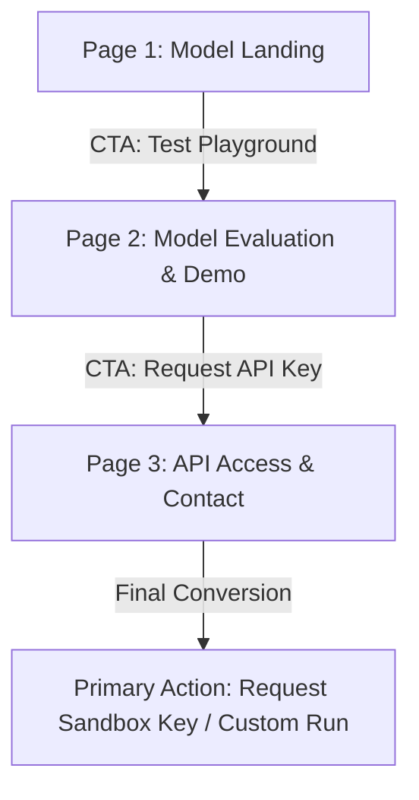

# Portfolio Content Map & Claim Strategy
**Prepared by Saad Ali — Machine Learning Track**

This document lays out the core positioning claim, sitemap structure, and evidence requirements for Saad Ali's Machine Learning Portfolio. It serves as the blueprint for building the portfolio website.

---

## 1. The One-Line Claim

To craft the perfect value proposition, we generated ten options targeting engineering managers who value technical transparency over marketing fluff:

### 10 Candidate Claims (AI-Generated Options)
1. *Empirical & Direct:* "I train search-ranking models on messy, real-world data and document exactly where they fail."
2. *Queue-Focused:* "I build transparent search priority models that reduce review queues by surface-ranking content opportunity and latency limits."
3. *Pipeline-Focused:* "I design machine learning pipelines that rank content refresh opportunities, showing engineering leads the precise limits of model accuracy."
4. *Latency-Focused:* "I deploy machine learning prototypes that prioritize unoptimized search pages under a 14ms latency constraint."
5. *Transparency-Focused:* "I build machine learning tools that rank content opportunity on real-world search data, presenting clear latency and error profiles."
6. *Failure-Oriented:* "I train models to prioritize search performance data and map out their known failure modes and latency limits."
7. *Opportunity-Focused:* "I develop machine learning prototypes that highlight high-opportunity search content while openly profiling model edge cases."
8. *Playground-Focused:* "I train search performance models that prioritize messy page-level data, with a live playground displaying latency and precision benchmarks."
9. *Data-Focused:* "I deploy models that rank content refresh potential on dirty search datasets, backed by transparent feature weights and latency tests."
10. *Boundary-Focused:* "I build machine learning prototypes that prioritize content updates, providing engineering leads with clear validation benchmarks and failure boundaries."

---

### Selected and Sharpened Claim

> **"I train search-priority models that rank messy, page-level data under clear latency limits, showing engineering leads exactly where the prototype succeeds and fails."**

#### Rationale for Selection:
- **Speaks to the Audience**: Directly addresses the "AI engineering manager" by using technical, precise language ("search-priority models", "page-level data", "latency limits").
- **Core Proof Claim**: Promises a working model, but matches the "honesty" theme of the ML track ("showing leads exactly where the prototype succeeds and fails").
- **No Banned Words**: Avoids causal verbs like "proves", "causes", or "will increase". It focuses strictly on decision-support ranking.

---

## 2. Portfolio Content Map

Our sitemap consists of a single-scroll, high-fidelity experience optimized to guide a visitor from initial claim, to empirical proof, to the primary action.

### Page 1: Model Landing
* **Role**: LANDING (Establish credibility and display top-line stats immediately)
* **Lead Case**: **Model Landing (Hero Claim & Benchmarks)**
* **Ordered Sections**:
  1. **Monospace Navigation Header**: Flat `[S]` monogram logo, links: *Playground*, *Model Specs*, *API Request*.
  2. **Hero Block**: Displays the sharpened one-line claim with a secondary subtitle explaining our "empirical transparency" philosophy.
  3. **Live Metric Dashboard**: Visual comparison widget showing the Random Forest model's Precision@50 lift (from **0.24** baseline to **0.74** model score) and **14ms** inference latency computed directly on the test set.
* **Call to Action (CTA)**: `"Stress-Test the Model Live →"` (Scrolls down to Page 2 / Playground).

### Page 2: Model Evaluation & Demo
* **Role**: PROOF (Open the black box, build technical trust, and show data integrity)
* **Lead Case**: **Model Evaluation & Demo (Live Playground & Logs)**
* **Ordered Sections**:
  1. **Interactive Scorer Playground**: A live input field where visitors enter a search query, impressions, and clicks, and see the model's priority score and reason codes in real-time.
  2. **Model Specs & Feature Weights**: SVG charts (`top_feature_importance.svg`, `top_reason_codes.svg`, `action_mix.svg`) showing the model's inner decision logic.
  3. **Data Preprocessing Log**: A documentation timeline outlining how the raw anonymized GSC data was cleaned, filtered (removing leakage features), and split.
  4. **Limitations & Failure Modes**: An honest section detailing where accuracy degrades (e.g., low-volume tail queries or seasonal events) and what safeguards are in place.
* **Call to Action (CTA)**: `"Request API Sandbox Access →"` (Scrolls down to Page 3 / Contact).

### Page 3: API Access & Contact
* **Role**: ACTION (Conversion)
* **Lead Case**: **API Access & Contact (Bio & Action)**
* **Ordered Sections**:
  1. **Professional Bio**: Two sentences stating engineering scope: *"I train and deploy machine learning models that prioritize messy search performance data. I help engineering leads build honest, latency-sensitive prototypes that show exactly where they succeed and where they fail."*
  2. **API Sandbox Access Form**: Flat input fields (Name, Email, Target Domain) to request a mock API key.
  3. **Custom Model Run Contact**: Link to book a session to evaluate the model on the manager's own GSC datasets (`saad@example.com`).
* **Call to Action (CTA)**: **`"Request Sandbox API Key"`** / **`"Schedule Custom Model Run"`** (Submit / Email, laddering directly to the primary action from Week 1).

---

## 3. Evidence Checklist ("Still Need to Gather")

To ensure the portfolio build week is not blocked, here is the honest list of proofs, files, and links we must assemble:

### Real Captures & Performance Metrics
* [ ] **`top_feature_importance.svg`**: SVG chart detailing the statistical weights of search signals (impressions, clicks, position) after running the evaluation script `04_evaluate_and_export.py`.
* [ ] **`top_reason_codes.svg`**: Chart displaying baseline heuristic priority reasons.
* [ ] **`action_mix.svg`**: Chart showing the distribution of recommendations (e.g., Refresh, Monitor, Leave Alone).
* [ ] **Live Latency Benchmark**: Verification of the 14ms inference speed on a standard local environment (to be exported/printed in the stats panel).
* [ ] **Model Accuracy Metrics**: Exact precision/recall curves from the Colab notebook.

### Code & Live Links
* [ ] **GitHub Repository Link**: Public link to Saad's fork of the internship repository, containing clean, commented scripts.
* [ ] **Live Portfolio Site Link**: The deployed portfolio URL (e.g., hosted on GitHub Pages or Vercel).
* [ ] **API Sandbox Gateway**: A simple javascript handler in `app.js` to simulate sandbox validation.

### Feedback & Verification
* [ ] **Testimonial/Review**: An honest evaluation note from the internship mentor or model pipeline logs verifying performance on the full dataset release.
