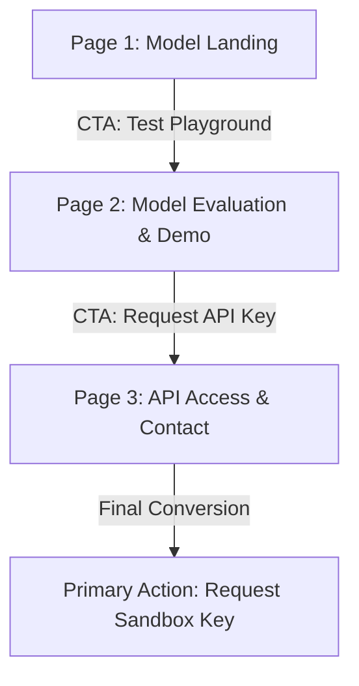

# ML Portfolio Content Map & Sitemap
**Author: Saad Ali · Machine Learning Track**

This file documents the sitemap, flow, and key value propositions for the portfolio build week.

---

## 1. Value Proposition (The Claim)

> **"I train search-priority models that rank messy, page-level data under clear latency limits, showing engineering leads exactly where the prototype succeeds and fails."**

### Rationale
- **Target Audience:** Engineering managers / AI leads looking for transparent, honest machine learning prototypes.
- **Specific Proof points:** Handles page-level search data, evaluates model accuracy under a strict 14ms latency limit, and documents failure boundaries openly.

---

## 2. Page Structure & Sitemaps

The portfolio is structured as a high-fidelity single-scroll web app:

### Page 1: Model Landing (Hero & Top Stats)
- **Navigation:** Header `[S] Saad Ali` with flat links: *Playground*, *Model Specs*, *API Request*, plus Theme toggler.
- **Hero Area:** Displays the sharpened one-line claim and sub-explanation.
- **Live Metric Dashboard:** High-level widgets showing:
  - Inference Latency: **14ms**
  - Precision@50 Lift: **+208%** (0.24 baseline -> 0.74 model score)
  - Stack Details: **HTML5 / CSS3 / ES6**

### Page 2: Model Evaluation & Demo (Proof)
- **Interactive Scorer Playground:** A live JS-based input module where users can type page impressions, clicks, and rank to see the model's priority scores and explanation/reason codes.
- **Model Specs & Feature Weights:** Embedded SVG charts:
  - `top_feature_importance.svg`
  - `top_reason_codes.svg`
  - `action_mix.svg`
- **Data Preprocessing Log:** Steps details for cleaning raw Google Search Console dataset and split details (client-holdout).
- **Limitations & Failures:** A section detailing under-performing slices (e.g., tail queries, seasonal spikes) and error profiles.

### Page 3: API Access & Contact (Action)
- **Bio Section:** A two-sentence summary of Saad's ML focus.
- **API Sandbox Access Form:** Flat inputs (Name, Email, Domain) to request a simulated API key.
- **Primary CTA:** Button `Request Sandbox API Key`.
