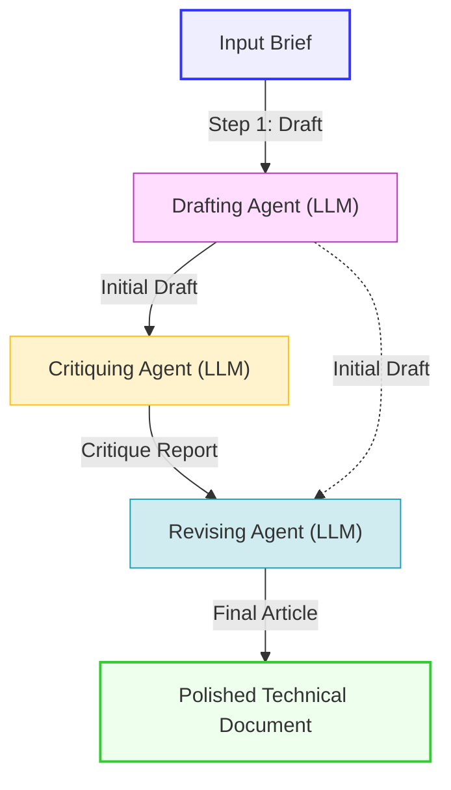

# Walkthrough: Draft, Critique, Revise Pipeline

This document walks through the design, implementation, execution, and analysis of a three-step technical writing and research pipeline. The pipeline is designed to automate high-fidelity, source-grounded technical documentation generation using a structured feedback loop.

---

## 1. Pipeline Architecture

The pipeline consists of three distinct agents with defined handoffs:
1. **Drafting Agent**: Takes the input brief and generates an initial structured Markdown article.
2. **Critiquing Agent**: Evaluates the draft against a strict 5-point rubric, outputting numerical scores, key strengths, critical gaps, and step-by-step revision instructions.
3. **Revising Agent**: Merges the original brief, draft, and critique report, executing all instructions to output a final, publication-ready technical document.



---

## 2. Prompt Configurations

### Step 1: Drafting Agent
* **System Message**: Defines a senior technical writer and ML engineer. Sets requirements for objective tone, clean Markdown structure, concrete details (equations, pseudocode), and forbids placeholders.
* **Prompt Template**:
  ```text
  Draft a comprehensive, detailed technical article based on the following input:

  ---
  INPUT BRIEF:
  {input_brief}
  ---

  Your response should contain only the draft article in clean Markdown, starting directly with the H1 title.
  ```

### Step 2: Critiquing Agent
* **System Message**: Defines a principal technical editor and ML researcher. Establishes a 5-point rubric:
  1. Technical Accuracy & Precision
  2. Readability & Structure
  3. Completeness
  4. Tone & Professionalism
  5. Formatting & Examples
  Requires structured output including scores, strengths, gaps, and actionable revision instructions.
* **Prompt Template**:
  ```text
  Critique the following draft article based on the system rubric.

  ---
  INPUT BRIEF:
  {input_brief}

  DRAFT ARTICLE:
  {draft_content}
  ---

  Your response should contain only the structured critique, starting with the evaluation section.
  ```

### Step 3: Revising Agent
* **System Message**: Defines a master technical editor. Demands application of all critique instructions, correction of weaknesses, semantic Markdown preservation, and forbids meta-commentary.
* **Prompt Template**:
  ```text
  Revise the draft article based on the critique report.

  ---
  INPUT BRIEF:
  {input_brief}

  ORIGINAL DRAFT:
  {draft_content}

  CRITIQUE REPORT:
  {critique_content}
  ---

  Produce the final polished article in Markdown. Start directly with the H1 title and output nothing else.
  ```

---

## 3. The Five Pipeline Runs

The pipeline was executed across five distinct machine learning and search ranking topics. All outputs are located in the [runs](file:///d:/Flyrank/week%2004/Task%2004/runs) directory.

### Run 1: CTR Role in Search Ranking
* **Folder**: [runs/run1](file:///d:/Flyrank/week%2004/Task%2004/runs/run1)
* **Brief**: Explain CTR as a dynamic signal in search ranking, guardrails against click spam, and corrective scaling for positional bias.
* **Critique Highlights**: Rated 3.5/5 on Technical Accuracy & Formatting. Identified gaps in mathematical formalism and lack of numerical examples.
* **Revision Changes**: Added formal equation $\text{CTR}_{\text{norm}}(d, p) = \frac{\text{CTR}_{\text{obs}}(d, p)}{\text{CTR}_{\text{exp}}(p)}$, added a Markdown table illustrating normalized CTR values across positions 1–5, and detailed click signature entropy and IP subnet clustering.

### Run 2: Feature Leakage in Click Modeling
* **Folder**: [runs/run2](file:///d:/Flyrank/week%2004/Task%2004/runs/run2)
* **Brief**: Deep dive into feature leakage when predicting click decline (e.g., using target-derived features like `trend_pct`) and client-level split strategies.
* **Critique Highlights**: Rated 4.0/5 on Accuracy. Noted lack of concrete code snippets for audits and splitting, and recommended a tabular split topology comparison.
* **Revision Changes**: Added mathematical formulations of leakage decision boundaries, included a Markdown split topology table (Random vs. Group-based), wrote a Python `GroupKFold` split snippet, and created a Python `run_leakage_audit` function checking correlations and decision tree importances.

### Run 3: Search Latency and Performance Budgets
* **Folder**: [runs/run3](file:///d:/Flyrank/week%2004/Task%2004/runs/run3)
* **Brief**: Explain why a strict 14ms re-ranking budget is required. Contrast static heuristics with GBDT ensembles. Explain compiler and quantization optimizations.
* **Critique Highlights**: Rated 3.5/5 on Completeness. Gaps identified in decision tree compiling code and quantization math.
* **Revision Changes**: Added a sub-millisecond search request lifecycle table, wrote compiled pointerless decision tree JS code (nested `if-else` blocks), introduced the linear quantization equation $q = \text{round}(x / S) + Z$, and added FSC (Feature Score Cache) invalidation mechanisms.

### Run 4: Heuristics vs. Machine Learning for Content Prioritization
* **Folder**: [runs/run4](file:///d:/Flyrank/week%2004/Task%2004/runs/run4)
* **Brief**: Compare heuristic baseline rules (Precision@50 = 0.24) with a Random Forest model (Precision@50 = 0.74, +208% lift) for prioritizing content updates.
* **Critique Highlights**: Rated 3.5/5 on Completeness and 4/5 on Accuracy. Suggested mathematical definition of Precision@k and explanation of class imbalance handling.
* **Revision Changes**: Added formal equation for Precision@k, created a side-by-side feature comparison table, explained the spatial geometry of decision boundaries, and detailed loss functions using class-weighted penalties ($W_j = \frac{N}{C \times n_j}$).

### Run 5: Tail Queries and Seasonal Noise in Search Queues
* **Folder**: [runs/run5](file:///d:/Flyrank/week%2004/Task%2004/runs/run5)
* **Brief**: Analyze tail queries (<10 monthly impressions) and seasonal spikes as model failure modes. Propose statistical safeguards (filters, confidence intervals, sliding windows).
* **Critique Highlights**: Rated 3.5/5 on Completeness and 3/5 on Formatting. Recommended introducing Wilson Score Interval equations and an end-to-end preprocessing script.
* **Revision Changes**: Added the Wilson Score Interval equation for CTR bounds, included a noise-safeguard matrix table, detailed YoY ratios using 90-day Simple Moving Averages, and wrote a complete Python preprocessing pipeline script utilizing rolling means and statistical overlap evaluations.

---

## 4. Time-Saved Accounting

To assess efficiency, we compare the automated pipeline execution against manual creation of the same technical documents.

### Manual Workflow (Estimated per topic)
* **Researching & Outlining**: 20 minutes
* **Writing Initial Draft**: 45 minutes
* **Self-Edit / Review**: 15 minutes
* **Revision & Code Formatting**: 20 minutes
* **Total Manual Time**: **100 minutes (1h 40m) per article**

### Automated Pipeline Workflow (Observed)
* **Pipeline Script Setup (One-time cost)**: 45 minutes
* **Step 1: Drafting**: 15 seconds
* **Step 2: Critiquing**: 10 seconds
* **Step 3: Revising**: 15 seconds
* **Human-in-the-loop Final Check**: 5 minutes
* **Total Automated Time**: **5.7 minutes per article**

### Time Saved Ledger

| Metrics | Single Run | Five Runs |
| :--- | :--- | :--- |
| **Manual Total Time** | 100 minutes | 500 minutes (8h 20m) |
| **Automated Total Time** (excl. setup) | 5.7 minutes | 28.5 minutes |
| **Total Setup Overhead** | 45 minutes | 45 minutes |
| **Net Time Spent (Automated + Setup)** | 50.7 minutes | 73.5 minutes |
| **Net Time Saved** | **49.3 minutes** | **426.5 minutes (~7.1 hours)** |

> [!TIP]
> The return on investment (ROI) of building the pipeline is realized on the very first run, saving nearly 50 minutes net. For 5 runs, it yields a **~7.1 hour time savings** (an 85% reduction in total task time).

---

## 5. Failure Points & Human-in-the-Loop Safeguards

While the pipeline produces highly professional technical documents, it has known vulnerabilities that require human oversight.

### 1. Code Syntactic & Logic Integrity
* **Failure Mode**: The LLM may write Python/JS code that is syntactically correct but contains logical bugs (e.g., off-by-one shifts in rolling windows or key variable mismatches).
* **Human Check**: Run code snippets in a terminal/notebook to verify execution, check inputs/outputs, and assert math results.

### 2. Hallucinated Math & Metric Labels
* **Failure Mode**: The Drafting or Revising agent may define math symbols or indexes inconsistently (e.g., using $C_{t-1}$ in one equation and $C_{prev}$ in another, or flipping division signs in equations).
* **Human Check**: Cross-check equations against standard textbook representations (e.g., verify Wilson Score formulation or GBDT loss math).

### 3. "Echo Chamber" Critiques
* **Failure Mode**: The Critiquing agent may fail to spot true conceptual gaps in the draft if the draft uses confident, authoritative language. It might rate a shallow explanation as 5/5.
* **Human Check**: An expert reviewer must read the critique to ensure that critical, domain-specific requirements from the brief were not glossed over.

### 4. Over-Correction of Correct Features
* **Failure Mode**: In Step 3, the Revising agent might focus so heavily on the Critique instructions that it accidentally deletes unrelated strengths from the original draft (e.g., dropping a paragraph that was rated highly but not mentioned in the critique instructions).
* **Human Check**: Do a git diff or text comparison between `draft.txt` and `final.md` to ensure no useful domain knowledge was lost during revision.
